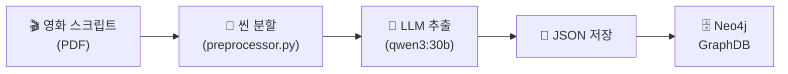

# GraphDB 구축 방법론

## 전체 파이프라인



---

## Step 1: 스크립트 수집

- **출처:** Script Slug (scriptslug.com)
- **수량:** 83편 (2020~2024년 인기 영화)
- **포맷:** PDF → `scripts_pdf/`에 저장

## Step 2: 씬 분할 (preprocessor.py)

PDF에서 텍스트 추출 후, **INT./EXT. 헤더 패턴**으로 씬 경계를 감지:

```python
# 씬 헤더 패턴
pattern = r'^(\d+\s+)?(INT\.|EXT\.|INT/EXT\.|I/E\.).*'

# 예시:
# "INT. BARBIE DREAMHOUSE. BEDROOM. DAY"  → 새 씬 시작
# "EXT. DESERT HIGHWAY - NIGHT"           → 새 씬 시작
```

**출력:** `processed_scripts/{영화명}_script.json`
```json
[
  {"scene_id": 1, "title": "INT. APARTMENT - DAY", "content": "..."},
  {"scene_id": 2, "title": "EXT. STREET - NIGHT", "content": "..."},
  ...
]
```

## Step 3: Sliding Window + LLM 추출

### 슬라이딩 윈도우 방식

씬 3개를 하나의 **SceneWindow**로 묶어서 LLM에 전달:

```
전체 스크립트: [씬1, 씬2, 씬3, 씬4, 씬5, 씬6, 씬7, 씬8, 씬9 ...]
                  └──────┘     └──────┘     └──────┘
                  Window 1     Window 2     Window 3
                     │            ↑
                     └── 요약 ────┘  (연속성 유지)
```

| 파라미터 | 값 |
|---------|-----|
| Window Size | 3 scenes |
| Stride | 3 (비중첩) |
| 연속성 유지 | summary_for_next_window |

### 요약 전달 메커니즘

각 윈도우 분석 후 LLM이 **다음 윈도우를 위한 요약**을 생성:

```
Window 1 분석 → 결과 + summary: "주인공이 여행을 떠남"
                                    ↓
Window 2 분석 (입력에 이전 요약 포함) → 맥락 유지
                                    ↓
Window 3 분석 (입력에 이전 요약 포함) → 서사 흐름 연속
```

### LLM 추출 항목 (온톨로지)

각 윈도우에서 추출하는 요소:

| 카테고리 | 값 | 근거 |
|---------|-----|------|
| **Narrative Phase** | Exposition, Rising, Climax, Falling, Resolution | Freytag의 5단계 서사 구조 |
| **Narrative Trope** | Revenge, Quest, Discovery, Escape, Redemption, Sacrifice, Betrayal | TVTropes 기반 서사 패턴 |
| **Dominant Emotion** | Joy, Trust, Fear, Surprise, Sadness, Disgust, Anger, Anticipation | Plutchik의 감정 바퀴 |
| **Persona Archetype** | Hero, Anti-Hero, Mentor, Shadow, Trickster, Rebel, Caregiver, Lone Wolf | Jung/Campbell의 원형 이론 |
| **Relationship Type** | Kinship, Rivalry, Mentorship, Romantic, Ally, Enemy, Professional | 사회학적 관계 분류 |
| **Setting Category** | Urban, Nature, Indoor, Tech, Historical, Surreal, Void | 서사 공간 분류 |

### LLM 출력 JSON 구조

```json
{
  "meta": {
    "current_scenes": ["S1", "S2", "S3"],
    "summary_for_next_window": "주인공이 뉴욕에 도착하여..."
  },
  "narrative": {
    "phase": "Exposition",
    "trope": "Quest",
    "feature_description": "주인공의 목표 설정 장면"
  },
  "characters": [
    {
      "name": "Bob",
      "archetype": "Hero",
      "goal": "음악가로 성공하기",
      "emotional_state": "Anticipation"
    }
  ],
  "relationships": [
    {
      "from": "Bob",
      "to": "Woody",
      "type": "Mentorship",
      "dynamic_change": "신뢰 형성"
    }
  ],
  "emotions_and_settings": {
    "dominant_emotion": "Anticipation",
    "atmosphere": "긴장과 기대가 공존",
    "setting_category": "Indoor"
  }
}
```

## Step 4: Neo4j 로딩

JSON → Neo4j 그래프로 변환:

```
Movie (83개)
  └─HAS_WINDOW→ SceneWindow (3,848개)
                    ├─IN_PHASE→ NarrativePhase (5종)
                    ├─HAS_TROPE→ Trope (7종)
                    ├─HAS_EMOTION→ Emotion (8종)
                    └─IN_SETTING→ Setting (7종)

Character (1,413개)
  ├─APPEARS_IN→ SceneWindow
  ├─BELONGS_TO→ Movie
  ├─HAS_ARCHETYPE→ PersonaArchetype (8종)
  └─RELATES_TO→ Character
```

### 최종 그래프 통계

| | 수량 |
|---|------|
| **영화** | 83편 |
| **SceneWindow** | 3,848개 |
| **Character** | 1,413명 |
| **총 노드** | ~5,400개 |
| **총 관계** | ~34,000개 |

## 사용 기술

| 단계 | 도구 |
|------|------|
| PDF 텍스트 추출 | PyMuPDF (fitz) |
| LLM | Ollama + qwen3:30b |
| Graph DB | Neo4j (Aura Free) |
| 언어 | Python 3.11 |
